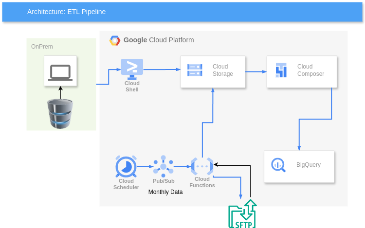

# GCP ELT Pipeline for Retail Transactions

## Overview
This project is designed to automate the ingestion, storage, transformation, and orchestration of retail transaction data from an on-premise UNIX server to Google Cloud. The solution utilizes Google Cloud Storage (GCS), BigQuery, and Cloud Composer (Airflow) to enable data analysis and reporting on consumer spending trends before and after interest rate changes.

## Architecture
### Diagram



### **High-Level Architecture Diagram**

```
+-------------------+       +-------------------+        +-------------------+
|  UNIX Server      |  ---> | Google Cloud      |  --->  |  Cloud Composer   |
| (Transaction      |       | Storage (GCS)     |        |  (Airflow DAGs)   |
| Data Source)      |       | (Raw Data)        |        | (Orchestration)   |
+-------------------+       +-------------------+        +-------------------+
                                    ^                           |
        ____________________________|                           v
       |                                               +------------------+
       |                                               | Google BigQuery   |
       |                                               | (Data Warehouse)  |
       |                                               | (Transformation)  |
       |                                               +------------------+
       |
+-------------------+
| External Vendor  |  --->  (Monthly Economic Data Ingestion)
| (Macroeconomics  |
| Indicators)      |
+-------------------+
```

## Components
### 1. **Data Ingestion**
   - Transaction data is fetched daily from a UNIX server via SFTP.
   - The ingested data (CSV format) is stored in **Google Cloud Storage (GCS)** under a `raw/` folder.
   - Macroeconomics indicators are sourced monthly via SFTP from an external vendor.

### 2. **Storage**
   - **Google Cloud Storage (GCS):** Used to store raw and processed transaction data.
   - **Google BigQuery:** A data warehouse where the ingested data is loaded and transformed.

### 3. **Transformation**
   - Data is loaded from GCS into BigQuery using Airflow DAGs.
   - Data is cleaned and enriched with additional terminal metadata.
   - The table is partitioned by day for optimized querying.

### 4. **Orchestration**
   - **Cloud Composer (Airflow)** schedules and manages the data pipeline.
   - DAGs ensure ingestion, transformation, and reporting tasks run automatically.

## Deployment
This project is deployed using **Terraform** for infrastructure provisioning.

### **Steps to Deploy**
1. Clone the repository:
   ```sh
   git clone https://github.com/jagadish-pallapolu/data_engineering_etl_pipeline.git
   cd data_engineering_etl_pipeline
   ```
2. Initialize and apply Terraform:
   ```sh
   cd terraform
   terraform init
   terraform apply
   ```
3. Install Python Packages for Local setup
   ```sh
   pip install requirments.txt
   ```
4. Verify Cloud Composer, GCS, and BigQuery resources are created.
5. Deploy Airflow DAGs by copying them to the Composer environment.

## Repository Structure
```
├── dags/                      # Airflow DAGs for orchestration
│   ├── transaction_pipeline.py
├── terraform/                  # Terraform scripts for infrastructure
│   ├── main.tf
│   ├── variables.tf
│   ├── schema.json
├── scripts/                    # Python scripts for ingestion & transformation
│   ├── ingest_unix_to_gcs.py
│   ├── transform_bq.py
├── configs/                    # Configuration files
│   ├── airflow_variables.json
├── data/                       # Sample datasets for testing
├── .gitignore                   # Ignore unnecessary files
├── README.md                    # Project documentation
```

## Next Steps
- Implement monitoring using **Cloud Logging & Monitoring**.
- Optimize queries for performance and cost efficiency in BigQuery.
- Automate CI/CD for Terraform deployment.

## License
This project is open-source and licensed under the MIT License.

